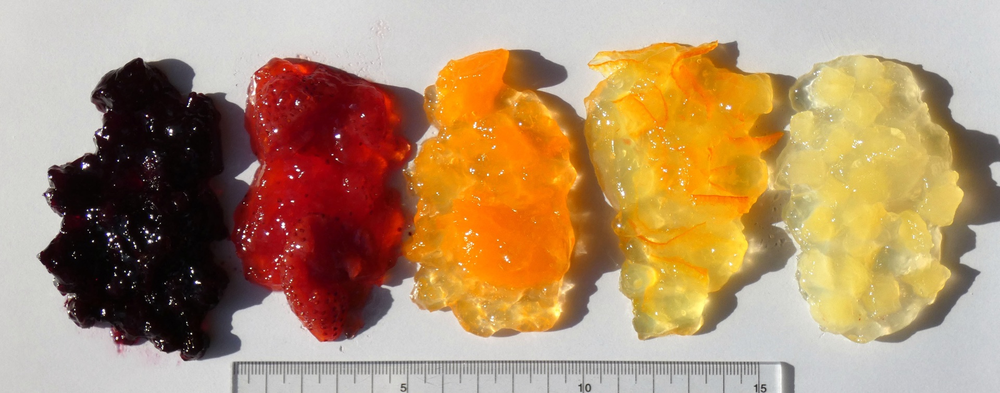
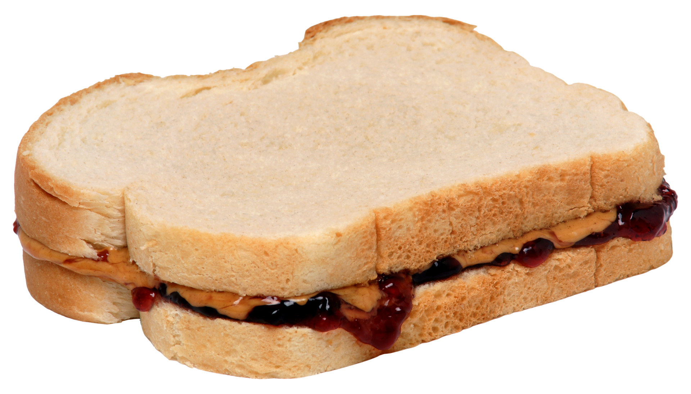
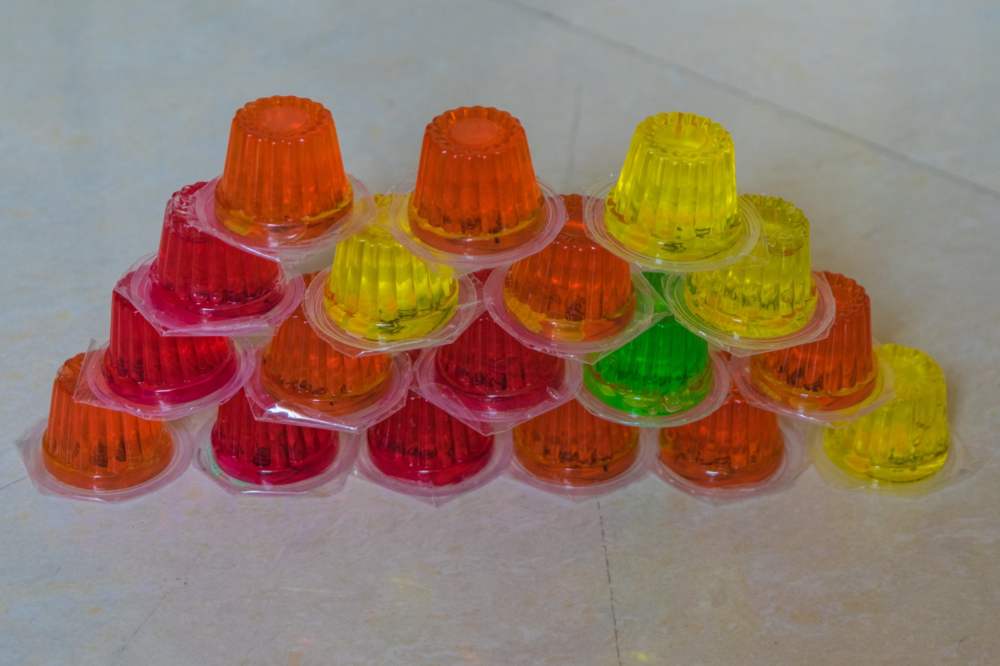
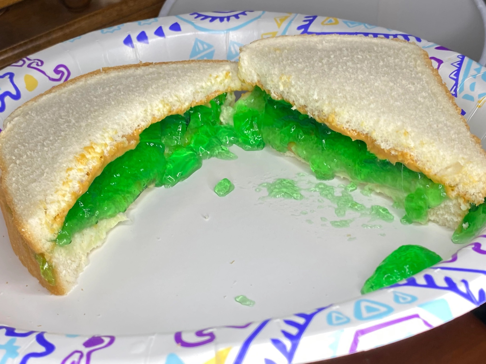
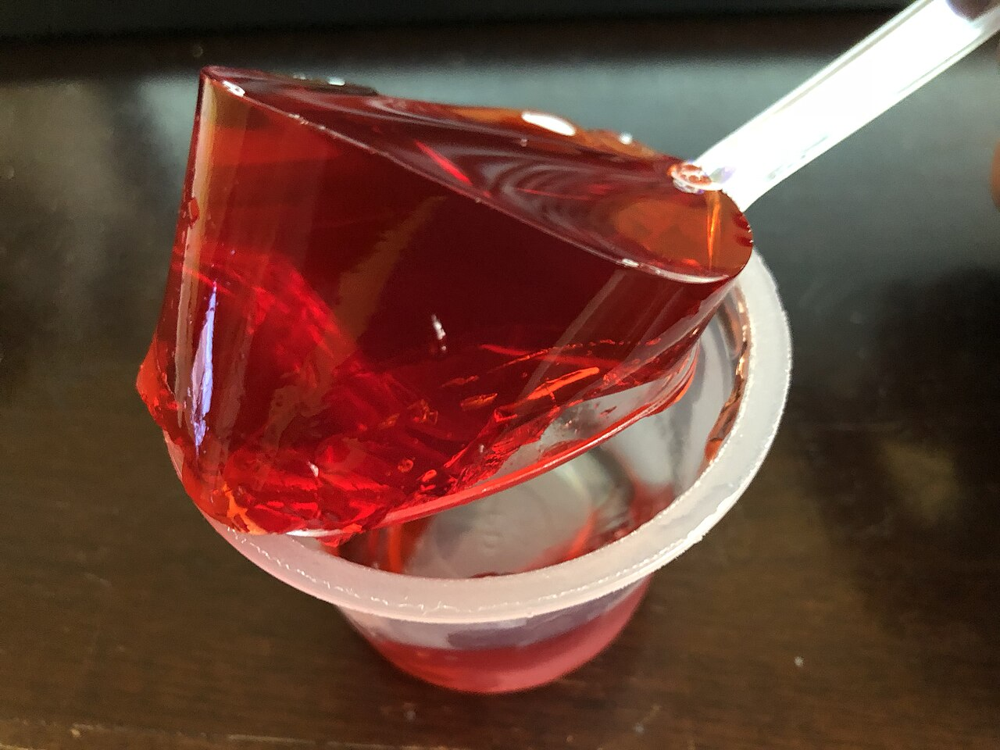
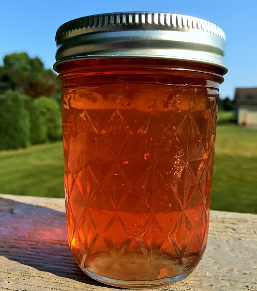

A few years ago, a friend from the UK asked me “What’s the difference between jam and jelly? For Americans, I mean”. 

It piqued my interest. I did some research, and sent a response.

At the time, my explanation hit our messaging app’s character limit twice over, and I had to brutally cut it down to bare bones. Today, I get to go into all the gory details.

## The First Deep Dive
And hence, *Deep Dives into Mundanity* was born.

“Jelly and Jam” is the origin and pinnacle of this series. 

Jam and jelly are both entirely mundane substances. The difference really doesn’t matter! It’s all sweet fruity stuff to put on your sandwich!

But I found it fascinating how the edges and layers of the topic folded to meet each other, like origami, or a pile of dirty clothes. 

Other topics may bear the same tag, but I am not convinced any will rise to meet the satisfaction I felt while researching and writing my explanation of gelatinized fruit stuff to my friend.

## Why Is This Even A Question?

Ok. Quick overview.

Both the US and the UK enjoy preserved fruit spreads. 

^[https://commons.m.wikimedia.org/wiki/File:Fruits_jam_variants.jpg]

These spreads come in a variety of flavors, and have a variety of names corresponding to different textures.

But importantly, in the United States, we have a sandwich, usually made with white bread, peanut butter, and one of these fruit spreads. 

And regardless of the actual name of the fruit spread, that sandwich is called a Peanut Butter and **Jelly** Sandwich. 

^[https://commons.m.wikimedia.org/wiki/File:Peanut-Butter-Jelly-Sandwich.png#mw-jump-to-license]

In the UK, however, the term Jelly is used for this stuff: 

^["[Jelly](https://commons.m.wikimedia.org/wiki/File:Jelly_(16622182031)_(2).jpg)”, by [Ashish Gupta from Noida, India](https://www.flickr.com/people/36853543@N00 is licensed under [CC BY 2.0](https://creativecommons.org/licenses/by/2.0/)]

So when folks in the UK hear “Peanut Butter and Jelly Sandwich,” they think of this abomination that I found on Reddit:

^[/u/PolymerPussies. “I made a peanut butter and jello sandwich..”  2020, https://www.reddit.com/r/shittyfoodporn/comments/izsqig/i_made_a_peanut_butter_and_jello_sandwich]

So if you ever say mention a PB&J and your friends from the UK react in horror. . . Yeah, that makes more sense, right?

## The Actual Differences
So on to the meat and potatoes. In the US, why do we call some of these fruit spreads “Jam” and some “Jelly”? And where do “Preserves” and “Marmalade” come in?

Well, it’s actually quite simple. 

*The names are different depending on what parts of the fruits are used, and what the texture of final product is.*

### Jello

^["[Gelatin from a single opened cup of Jell-O strawberry gelatin snack being lifted by a spoon in the Franklin Farm section of Oak Hill, Fairfax County, Virginia](https://commons.wikimedia.org/wiki/File:2019-10-10_22_15_43_Gelatin_from_a_single_opened_cup_of_Jell-O_strawberry_gelatin_snack_being_lifted_by_a_spoon_in_the_Franklin_Farm_section_of_Oak_Hill,_Fairfax_County,_Virginia.jpg#mw-jump-to-license)”, by [Famartin](https://commons.m.wikimedia.org/wiki/User:Famartin) is licensed under [CC BY-SA 4.0](https://creativecommons.org/licenses/by-sa/4.0/deed.en)]

We’re going to start slightly off-topic, by discussing gelatin dessert, the source of the confusion. 

As I mentioned before, people in the UK will call this food item “jelly”. 

In the US, this is called “gelatin” or “jello.”  

The term “jello” is a genericized version of the brand name “JELL-O”, a subsidiary of Kraft Foods, which specializes in the gelatin dessert.  As you may imagine, JELL-O does not appreciate that their brand name is being used generically. 

As you may imagine, I do not care that JELL-O does not appreciate that, and I will genericize their name all that I want. 

As the name suggests, jello is made primarily of gelatin, with added flavors (usually fruit flavors) and sweeteners. It comes in two main form factors: 
* Pre-made, single-serving plastic cups (pictured above)
* Boxes with packets of gelatin powder, for larger, homemade batches of jello

Jello is, ostensibly speaking, a solid, but one of its most notable characteristics is its *wobble*. 

Jello *jiggles*. 

The single-serving cups are consistently a texture that is just close enough ti liquid that, with enough effort, you could slurp the entire ingot of jello up all at once. If you wanted to do such a thing for some reason^[I usually don’t eat my jello in _one_ slurp, but I do use jello cups when I need a quick burst of hydration, thanks to my dysautonomia. Maybe one of these days I’ll make myself some hydration-specific jello cups with pedialyte or Gatorade.]

The powder jello is less consistent in texture. If you go to a buffet and you see cubes of jello in the dessert area, it was probably powder jello. And unfortunately, depending on how accurately prepared it, the texture can vary greatly. If it didn’t set enough, it may have the texture of curdled water. On the other hand, if too much gelatin powder was used, you may find yourself chewing on a soft eraser. 

Regardless. That’s jello. Why the name is different between the UK and the US is different, I’m not sure. Perhaps gelatin desswet wasn’t particularly popular in the US until JELL-O introduced it, meaning we adopted their name like xerox and bandaids.

^[https://commons.m.wikimedia.org/wiki/File:Fresh_crab_apple_Jelly.jpg]

Starting simple. In the US, Jelly is a 

In the US: 

Jello: gelatin dessert, eaten with a spoon. Keeps its shape when held. Wiggles. Most common flavor is cherry.  

Jam: preserved fruit with syrupy-gelatinized preserved juice. goes on a peanut butter sandwich, or on toast at breakfast. Somewhat spreadable. Has smallish chunks of mushy fruit in it. Can be used in place of Preserves or Jelly in most cases. Good general use. Blackberry/raspberry is probably best as jam. 

Preserves: fruits what have been heated with small amounts of pectin or gelatin, and canned. Fruit preserves are like jam, but the juicy part is liquidier and fruit chunks are larger. Best for baked goods with fruit in them, like baked Brie or danishes. Works well as an ice cream or cheesecake topping. Probably good for Strawberry Shortcake. Strawberry is best as preserves. 

Jelly: basically fruit juice that has been slightly gelatinized. Like jam without the fruit chunks. Almost like jell-o dessert, but doesn’t hold its shape nearly as well. Best for PB&Js for picky children, and easiest to spread on toast of the three.  Concord grape is basically only ever jelly, not jam or preserves.

JELL-O: brand that sells cups of jello (gelatin dessert) and pudding (sweet custard like dessert). Also sells JELL-O-brand gelatin dessert packets.

## Bonus Deep Dive: Custards and Puddings! 